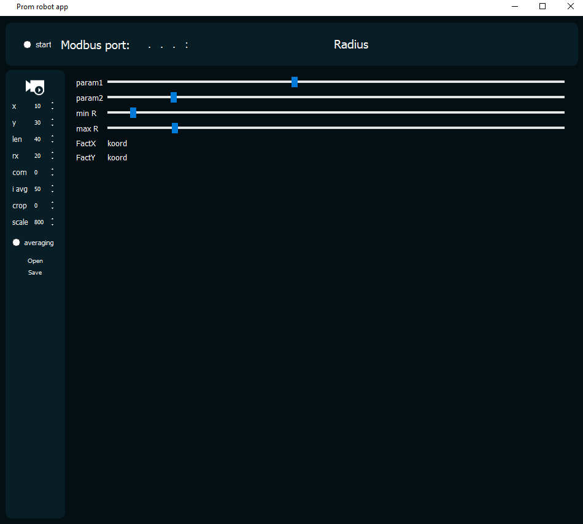

# Манипулятор с машинным зрением


Данное программное обеспечение реализует полный цикл взаимодействия между камерой, персональным компьютером, ПЛК (программируемым логическим контроллером) и манипулятором. Основная задача системы — автоматическое определение положения объекта (патрубка) на изображении с последующей передачей его координат в ПЛК для управления манипулятором. Система работает в непрерывном цикле, обеспечивая обработку изображений в реальном времени.

## Этапы работы
1. Захват изображения с камеры  
2. Предварительная обработка изображения  
3. Обнаружение окружностей  
4. Вычисление координат центра окружности  
5. Преобразование координат из пикселей в миллиметры  
6. Отправка координат в контроллер манипулятора  
7. Перемещение манипулятора по полученным координатам  

---

## Установка
```bash
git clone https://github.com/Kurmambet/PromR_App.git
python -m venv venv
venv\Scripts\activate
pip install -r requirements.txt
```

## Компиляция в исполняемый файл (.exe)
```bash
pyinstaller -w -F -i "C:\путь\к\iconka.ico" video_streaming.py
```

Готовое приложение доступно в разделе [Releases](https://github.com/Kurmambet/PromR_App/releases).

---

## Настройка

Параметры подключения и адреса регистров OPC-сервера представлены в конфигурационном файле `modbusconfig.mbp`.

> **Протокол:** Modbus TCP/IP over RTU

При получении сигнала на регистр `R20RX` от ПЛК, программа на ПК возвращает:
- координаты заготовки по X: `R10X`  
- координаты по Y: `R30Y`  
- количество обнаруженных заготовок в кадре: `R40BOXLEN`

Параметры подключения (IP-адрес и порт) можно изменить в пользовательском интерфейсе. По умолчанию используется адрес:

```text
127.0.0.1:502
```

> **Примечание:** Центр изображения считается нулевой точкой координат, так как он совмещён с центром захвата манипулятора.

### Калибровка масштаба

Для преобразования координат из пикселей в миллиметры необходимо задать реальный радиус заготовки:

```text
По умолчанию: 10 мм
```

---

## Дополнительные параметры

### Режим усреднения (`averaging`)

При активации режима `averaging` координаты объекта вычисляются на основе усреднения значений из нескольких кадров, когда манипулятор статично расположен над заготовками. Это повышает точность измерений.

Параметр `i avg` в UI задаёт количество кадров для усреднения.

### Параметры алгоритма обнаружения окружностей

| Параметр  | Описание                                     |
|----------|-----------------------------------------------|
| `param1` | Нижний порог для алгоритма обнаружения        |
| `param2` | Верхний порог для алгоритма обнаружения       |
| `minR`   | Минимальный радиус окружности (в пикселях)    |
| `maxR`   | Максимальный радиус окружности (в пикселях)   |

---

## Скриншот интерфейса

---

## Контакты

Автор проекта: [@Kurmambet](https://github.com/Kurmambet)  
Проект: [PromR_App](https://github.com/Kurmambet/PromR_App)
